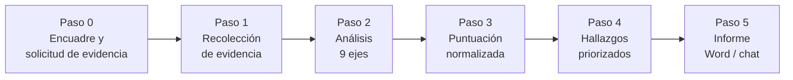

# Web Audit — Auditoría web comercial para Claude

Skill de Claude que audita un sitio web **como herramienta comercial, no como pieza visual**. Responde una sola pregunta: *¿por qué este sitio no está convirtiendo visitas en clientes, y qué hay que cambiar primero?*

Entrega un score 0–100 normalizado por cobertura, las fugas de conversión priorizadas con evidencia citada, copy reescrito (no "recomendaciones de copy") y un plan de acción a 24 horas / 7 días / 30 días — en informe Word cuando es para entregar a un cliente.

> Un sitio bonito que no vende obtiene un score bajo. Un sitio feo que convierte obtiene un score alto.

---

## ¿Qué lo diferencia?

La mayoría de "auditorías" hechas con IA son alucinaciones con formato bonito. Este skill está construido para evitarlo:

- **Evidencia antes que opinión.** Nunca describe una página que no leyó. Cada hallazgo lleva cita textual del sitio y URL exacta; un hallazgo sin evidencia no entra al informe.
- **Tres rutas de inspección declaradas.** Con navegador conectado (ruta A), con código aportado por el usuario (ruta B) o solo con obtención de páginas (ruta C). El skill sabe qué puede y qué no puede verificar en cada ruta, y lo declara en el informe.
- **NE ≠ 0.** Lo que no se pudo evaluar se marca como *no evaluado* y sale del denominador — no se castiga al sitio por los límites de la auditoría. Si la cobertura baja del 70 %, no se publica score.
- **Anti-inflación de notas.** La rúbrica incluye anclas de calibración por subcriterio y una distribución de referencia: el sitio típico de PyME es un 40–59, no un 70. Hay controles explícitos contra el promedio cómodo.
- **Copy escrito, no descrito.** "Mejorar el titular" no es un entregable; la versión reescrita sí.
- **Prioridad por impacto ÷ esfuerzo.** El cliente sabe qué mover el lunes por la mañana.

---

## Metodología



| Paso | Qué hace |
|---|---|
| **0 — Encuadre** | Pide URL, cliente ideal, acción principal, mercado, competidores y evidencia (capturas, `view-source`, PageSpeed) en un solo mensaje. No se detiene si faltan respuestas: infiere, marca suposiciones y sigue. |
| **1 — Evidencia** | Home + hasta 8 páginas priorizadas (conversión primero). Audita plantillas, no instancias. Detecta analítica, píxeles, CRM, pasarelas y metadatos; cruza consistencia entre plantillas; revisa cómo se ve el enlace al compartirlo (Open Graph); benchmark de 5 ejes contra competidores. |
| **2 — Análisis** | Nueve ejes: intención comercial, prueba de los 5 segundos, mensaje, estructura, credibilidad, CTAs, embudo, automatización y medición, experiencia móvil. |
| **3 — Puntuación** | Rúbrica de 100 puntos con anclas. Score = obtenidos ÷ evaluables × 100, siempre acompañado del % de cobertura. |
| **4 — Hallazgos** | Cada fuga con prioridad (Crítico / Alto / Medio / Bajo), impacto, esfuerzo, ubicación, evidencia y recomendación concreta. |
| **5 — Entregable** | Informe completo en Word (`Auditoria-Web-[Cliente]-[Fecha].docx`) o versión rápida en chat: score, 3 fugas principales, un titular y un CTA reescritos, 5 acciones de mayor impacto. |

---

## La rúbrica (100 puntos)

| # | Categoría | Puntos |
|---:|---|---:|
| 1 | Posicionamiento y claridad | 15 |
| 2 | Mensaje y contenido persuasivo | 15 |
| 3 | Estructura y navegación | 12 |
| 4 | Credibilidad y confianza | 12 |
| 5 | CTA y capacidad de conversión | 15 |
| 6 | Embudo de ventas | 15 |
| 7 | Experiencia móvil y usabilidad | 8 |
| 8 | Automatización y medición | 8 |

### Interpretación

| Score | Estado | Lectura |
|---:|---|---|
| 90–100 | Excelente | Comunica, genera confianza y convierte con poca fricción. Queda optimización fina. |
| 75–89 | Bueno | Base sólida con oportunidades claras de subir contactos o ventas sin tocar el tráfico. |
| 60–74 | Regular | Puede verse bien, pero tiene fugas de conversión importantes. |
| 40–59 | Débil | El mensaje, la estructura o el CTA dificultan la acción. Pagar publicidad antes de corregir esto es quemar presupuesto. |
| 0–39 | Crítico | El sitio no opera como sistema comercial. Reestructuración antes que optimización. |

---

## Módulos opcionales

| Módulo | Archivo | Cuándo se activa |
|---|---|---|
| **E-commerce** | `vertical-ecommerce.md` | Tiendas con carrito y checkout. Recorrido de checkout (sin completar pagos), disponibilidad de variantes y tallas, comprobación cruzada de políticas de envío y devolución. Ajusta criterios existentes sin tocar los 100 puntos. |
| **Contexto Colombia / LatAm** | `contexto-colombia.md` | Mercados donde WhatsApp es *el* canal de venta. Medios de pago locales (PSE, Nequi, contraentrega…), señales de confianza locales y tratamiento de datos personales (habeas data). |
| **Accesibilidad y SEO comercial** | `accesibilidad-y-seo.md` | A pedido, sectores regulados o venta a EE. UU. / UE. Se puntúa sobre 20 aparte — nunca se mezcla con el score de conversión. Cubre solo la capa observable de SEO que toca la venta. |

---

## Instalación

### Claude Code

La forma más simple es descomprimir el paquete, que ya trae la estructura correcta (`SKILL.md` + `references/`):

```bash
unzip web-audit.skill -d ~/.claude/skills/
```

Para instalarlo solo en un proyecto, usa `.claude/skills/` dentro del repositorio del proyecto en lugar de `~/.claude/skills/`.

### claude.ai

Sube el archivo `web-audit.skill` en **Configuración → Capacidades → Skills**.

### Instalación manual desde este repositorio

Los archivos de referencia viven en la raíz del repo, pero el skill los espera dentro de `references/`:

```bash
mkdir -p ~/.claude/skills/web-audit/references
cp SKILL.md ~/.claude/skills/web-audit/
cp accesibilidad-y-seo.md contexto-colombia.md formulas-copy.md \
   plantilla-informe.md rubrica-scoring.md vertical-ecommerce.md \
   ~/.claude/skills/web-audit/references/
```

---

## Uso

El skill se activa solo cuando la conversación trata de auditar, revisar o diagnosticar un sitio. Ejemplos:

```
Audita https://misitio.com — vendo repuestos de moto a talleres en Bogotá
y quiero más cotizaciones por WhatsApp.
```

```
Mi página recibe visitas pero no me llegan clientes. ¿Qué está fallando?
```

```
Hazme un diagnóstico rápido de esta landing antes de cotizarle el rediseño al cliente.
```

Para mejores resultados, ten a la mano:

1. **Tres capturas** — parte superior de la home en escritorio y en móvil, y el formulario o checkout en móvil (habilitan la categoría 7).
2. **El código** — `view-source` de la home, o el inventario de lo instalado (habilita la categoría 8).
3. **PageSpeed Insights** de la home y de la página de conversión.

Sin nada de eso el skill igual funciona: audita lo observable, marca el resto como no evaluado y lo declara en el score.

---

## Estructura del repositorio

| Archivo | Contenido |
|---|---|
| [SKILL.md](SKILL.md) | Instrucciones principales: encuadre, rutas de evidencia, ejes de análisis, normalización y reglas de calidad. |
| [rubrica-scoring.md](rubrica-scoring.md) | Las 8 categorías con subcriterios, anclas de calibración 0–4, distribución de referencia e interpretación del score. |
| [plantilla-informe.md](plantilla-informe.md) | Estructura obligatoria del informe (ficha técnica, veredicto, fugas, benchmark, plan de acción, hipótesis) y generación del Word. |
| [formulas-copy.md](formulas-copy.md) | Fórmulas de titulares, banco de CTAs por tipo de negocio, formato de testimonios, bloques de reducción de riesgo y ofertas intermedias. |
| [contexto-colombia.md](contexto-colombia.md) | Módulo Colombia / LatAm. |
| [vertical-ecommerce.md](vertical-ecommerce.md) | Módulo vertical de tiendas online. |
| [accesibilidad-y-seo.md](accesibilidad-y-seo.md) | Módulo complementario de accesibilidad (12 pts) y SEO comercial (8 pts), puntuado aparte. |
| `web-audit.skill` | Paquete ZIP instalable con la estructura final (`web-audit/SKILL.md` + `web-audit/references/`). |

---

## Delimitación con otros skills

Este skill define el **problema comercial** del sitio. No intenta cubrirlo todo:

| Si la pregunta es sobre… | Corresponde a |
|---|---|
| Por qué no convierte, copy, CTAs, embudo, confianza | **este skill** |
| Rankings, keywords, indexación, schema, Core Web Vitals, AI Overviews | un skill de `seo` |
| Contenido para redes sociales | un skill de contenido orgánico |
| Venta por chat y manejo de objeciones | un skill de ventas |

Para una auditoría "completa", el flujo recomendado es: primero esta auditoría (problema comercial) y luego la de SEO (problema de tráfico) — como dos informes, no mezclados.

---

## Créditos

Creado por **John Stevans Alvarez**. Escrito en español y calibrado para PyMEs y profesionales independientes, con módulos específicos para el mercado colombiano y latinoamericano.
